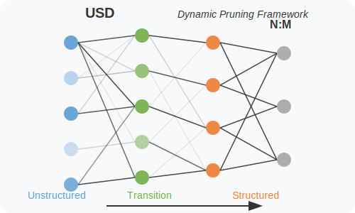

# USD - Unstructured then Structured Dynamic N:M Pruning Framework


 
[](LICENSE)
[](https://www.python.org/)
[](https://pytorch.org/)

USD is a novel neural network sparsification framework that implements a two-phase pruning approach: first unstructured pruning followed by structured N:M sparsity pattern optimization. It supports various architectures including ResNet, ViT, and Swin Transformer models.

## 🚀 Quick Start

```bash
# Clone the repository
git clone https://github.com/yourusername/USD
cd USD

# Install dependencies
pip install -r requirements.txt

# Run an example
python ./search/find_mix_from_dense_imagenet.py \
    --M 8 \
    --batch_size 120 \
    --data [dataset_path] \
    --num_classes [num_classes] \
    --target_sparsity 0.75
```

## ✨ Key Features

- 🔄 Two-phase pruning approach (Unstructured → Structured)
- 🎯 Dynamic N:M sparsity pattern adjustment
- 🏗️ Support for multiple model architectures
- ⚙️ Configurable sparsity targets and update intervals
- ⚖️ Weight penalty mechanisms
- 📊 Comprehensive logging and monitoring
- 🌐 Distributed training support

## 📋 Table of Contents

- [Installation](#installation)
- [Usage](#usage)
- [Supported Models](#supported-models)
- [Supported Datasets](#supported-datasets)
- [Project Structure](#project-structure)
- [Configuration](#configuration)
- [Citation](#citation)
- [License](#license)
- [Contributing](#contributing)

## 🛠️ Installation

1. Clone the repository:
```bash
git clone https://github.com/yourusername/USD
cd USD
```

2. Install dependencies:
```bash
pip install -r requirements.txt
```

## 💻 Usage

### Basic Usage

```bash
python ./search/find_mix_from_dense_imagenet.py \
    --M 8 \
    --batch_size 120 \
    --data [dataset_path] \
    --num_classes [num_classes] \
    --alpha -1 \
    --initialisation 1 \
    --target_sparsity 0.75 \
    --alpha_target_sparsity 0.9 \
    --with_weight_penalty 1 \
    --port [port_number] \
    --config [config_file] \
    --epoch_rfap 15 \
    --iter_update_erk [update_interval] \
    --erk_value [erk_value]
```

### Key Parameters

| Parameter | Description | Default |
|-----------|-------------|---------|
| `--M` | M value for N:M sparsity | 16 |
| `--batch_size` | Training batch size | 32 |
| `--target_sparsity` | Target sparsity ratio | 0.0 |
| `--iter_update_erk` | Update interval for N:M patterns | 100 |
| `--erk_value` | ERK sparsity value (-1 for dynamic) | -1 |

## 🏗️ Project Structure

```
USD/
├── devkit/                  # Core framework components
│   ├── core/               # Core functionality
│   ├── dataset/            # Dataset handling
│   └── sparse_ops/         # Sparse operations implementation
├── search/                 # Search algorithms and configurations
├── inference_benchmark/    # Inference testing utilities
├── results/               # Experimental results
├── resnet50/             # ResNet50 specific implementations
├── resnet18/             # ResNet18 specific implementations
└── test_method.sh        # Test script for running experiments
```

## 🧠 Supported Models

- ResNet50
- DeiT (Base and Small)
- ViT-B/16
- Swin Transformer

## 📚 Supported Datasets

- CIFAR-100
- ImageNet

## 📝 Configuration

Example configurations are provided in `search/script_resnet_ImageNet/configs/` for different model architectures.

## 📄 Citation

If you use this code in your research, please cite:

```bibtex
@article{usd2024,
  title={USD: Unstructured then Structured Dynamic N:M Pruning Framework},
  author={Your Name},
  journal={arXiv preprint},
  year={2024}
}
```

## 📜 License

This project is licensed under the MIT License - see the [LICENSE](LICENSE) file for details.

## 🤝 Contributing

Contributions are welcome! Please feel free to submit a Pull Request. For major changes, please open an issue first to discuss what you would like to change.

1. Fork the repository
2. Create your feature branch (`git checkout -b feature/AmazingFeature`)
3. Commit your changes (`git commit -m 'Add some AmazingFeature'`)
4. Push to the branch (`git push origin feature/AmazingFeature`)
5. Open a Pull Request

## 📞 Contact

Your Name - [@yourtwitter](https://twitter.com/yourtwitter) - email@example.com

Project Link: [https://github.com/yourusername/USD](https://github.com/yourusername/USD)

## Command Line Arguments

The script accepts the following command-line arguments:

### Required Arguments
- `--data` (str): Path to the dataset directory
- `--model_dir` (str): Directory to save model checkpoints and logs
- `--config` (str): Path to configuration YAML file (default: 'configs/config_resnet50_2:4.yaml')

### Training Parameters
- `--M` (int): M value for N:M sparsity (default: 16)
- `--batch_size` (int): Training batch size (default: 32)
- `--num_classes` (int): Number of output classes (default: 1000)
- `--epoch_rfap` (int): Number of epochs to continue fine-tuning after target sparsity is achieved (default: 10)
- `--target_sparsity` (float): Target sparsity ratio (default: 0.0)
- `--iter_update_erk` (int): Iteration period for verifying and updating N and M values (default: 100)
- `--erk_value` (float): ERK value applied to all layers (-1 for dynamic) (default: -1)
- `--alpha` (float): Value to divide every group by to calculate NIntermediate (default: -1)
- `--alpha_target_sparsity` (float): Alpha value for target sparsity (default: 0.5)

### Distributed Training
- `--port` (int): Port number for distributed training (default: 29500)
- `--world-size` (int): Number of distributed processes (default: 1)
- `--rank` (int): Process rank for distributed training (default: 0)
- `--local_rank` (int): Local rank for distributed training

### Model Configuration
- `--initialisation` (int): Model initialization flag (default: 1)
- `--with_weight_penalty` (int): Enable weight penalty (default: 0)
- `--ste` (flag): Enable STE (Straight-Through Estimator)
- `--Target_RMSI` (float): Target RMSI value
- `--resume_from` (str): Path to checkpoint to resume training from
- `-e, --evaluate` (flag): Evaluate model on validation set
- `--schedule` (list[int]): Epochs to decrease learning rate (default: [30, 60])
- `--gamma` (float): Learning rate decay factor (default: 0.1)

### Example Usage
```bash
python ./search/find_mix_from_dense_imagenet.py \
    --M 8 \
    --batch_size 120 \
    --data [dataset_path] \
    --num_classes [num_classes] \
    --alpha -1 \
    --initialisation 1 \
    --target_sparsity 0.75 \
    --alpha_target_sparsity 0.9 \
    --with_weight_penalty 1 \
    --port [port_number] \
    --config [config_file] \
    --epoch_rfap 15 \
    --iter_update_erk [update_interval] \
    --erk_value [erk_value] 
```
